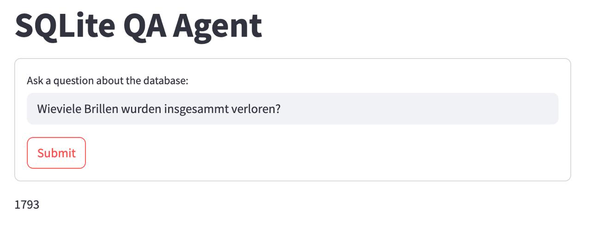
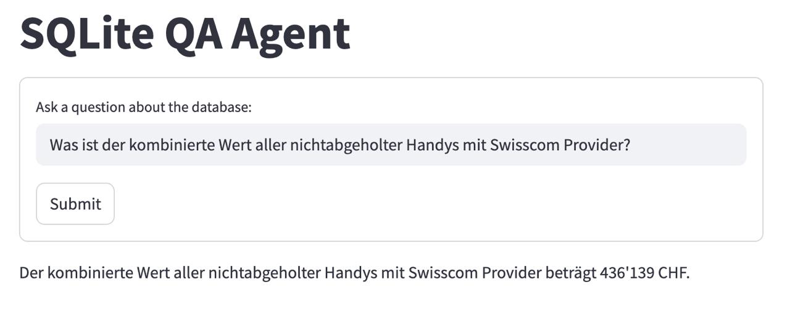
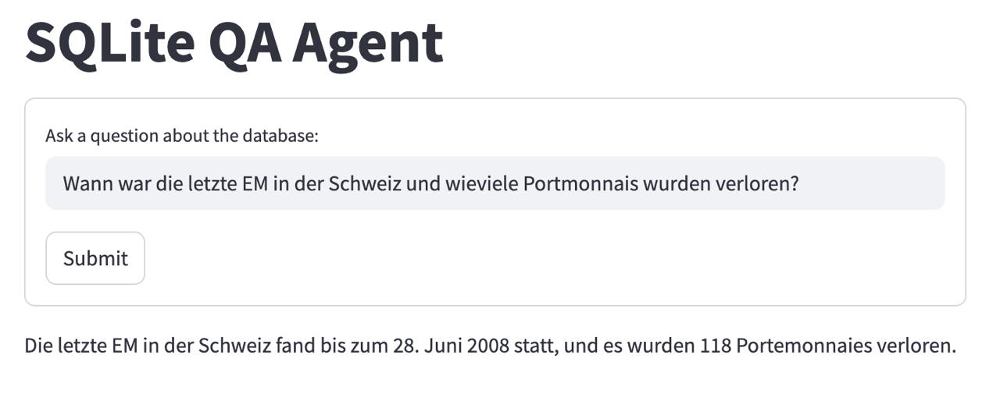

# Data Hackdays 2025 - Find Your Stuff

## Overview
### ETL Pipeline
This repository includes the generated SQLite database ([data/processed/primaerdaten.db](data/processed/primaerdaten.db)), created from the raw CSV and Excel files via the ETL script ([code/scripts/etl.py](code/scripts/etl.py)). This ETL pipeline reads all source files, infers foreign keys, and constructs the relational database.

### Interactive Map Preview
A basic proof-of-concept Leaflet.js map demonstrating item locations is available in [code/map](code/map).

### QA Agent App
The Streamlit-based QA Agent (in [code/qa_agent_app](code/qa_agent_app)) enables natural-language queries against the prebuilt SQLite database. This prototype may not handle all queries reliably and would need additional development for production.

**Screenshots:**




## Repository Structure

- **data/raw/**: Original CSV and Excel files from Primaerdaten.
- **data/processed/**: Generated SQLite database (`primaerdaten.db`).
- **code/scripts/**: ETL pipeline script to load raw files and build the relational database.
- **code/map/**: Interactive map demo for visualizing item locations.
- **code/qa_agent_app/**: Streamlit application for natural-language querying of the SQLite database.

## Prerequisites

- Python 3.12
- `pip` for installing dependencies
- OpenAI API key for the QA agent app

## Setup and Usage

1. Clone the repository:
   ```bash
   git clone https://github.com/your-username/find-your-stuff.git
   cd find-your-stuff
   ```

2. Install Python dependencies:
   ```bash
   pip install -r code/requirements.txt
   ```

3. (optional) Rebuild the SQLite database via ETL:
   ```bash
   python code/scripts/etl.py
   ```

4. Run the QA Agent App (Streamlit):
   ```bash
   export OPENAI_API_KEY="<your_api_key>"
   streamlit run code/qa_agent_app/app.py
   ```

## License

See [LICENSE](LICENSE) for details.
